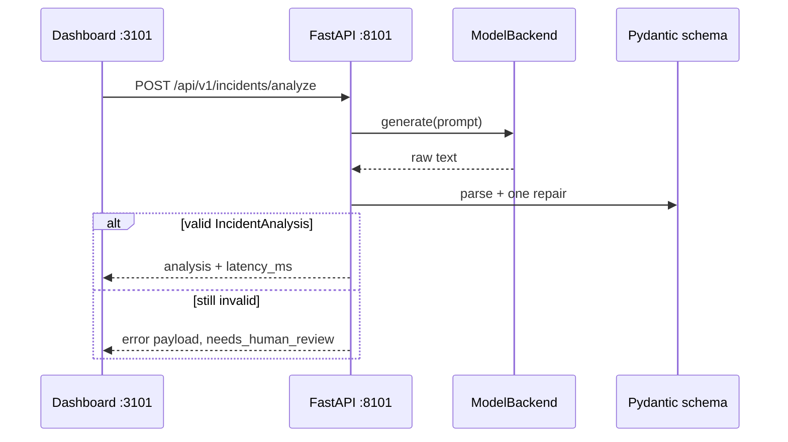

# Architecture overview

See the repository root [ARCHITECTURE.md](../../ARCHITECTURE.md) for the system diagram and backend contracts.

```mermaid
sequenceDiagram
  participant UI as Dashboard :3101
  participant API as FastAPI :8101
  participant B as ModelBackend
  participant P as Pydantic schema
  UI->>API: POST /api/v1/incidents/analyze
  API->>B: generate(prompt)
  B-->>API: raw text
  API->>P: parse + one repair
  alt valid IncidentAnalysis
    API-->>UI: analysis + latency_ms
  else still invalid
    API-->>UI: error payload, needs_human_review
  end
```

Ports: API 8101, Next.js 3101, MLflow 5101.
